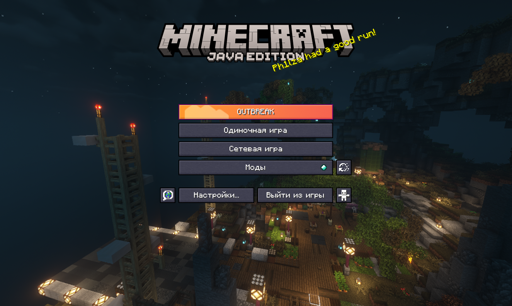
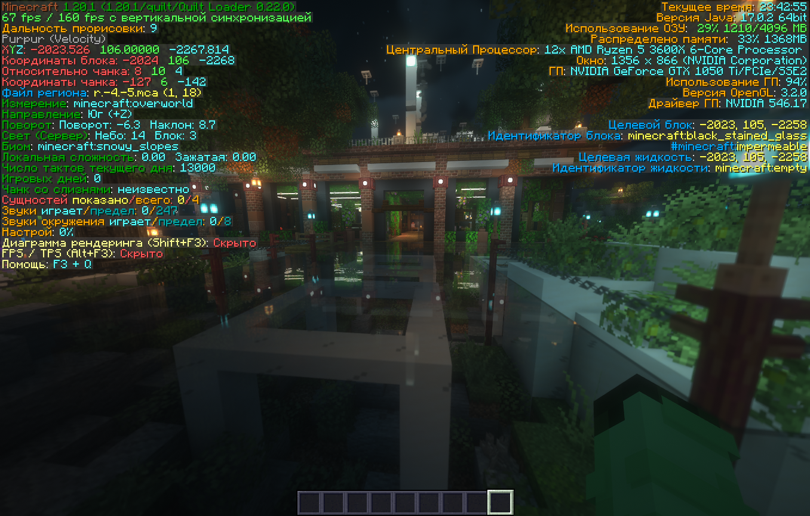
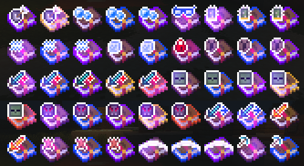

# Сборка OUTBREAK

  
  
  
  

Сборка построена на базе Fabric 1.20.1 с Sodium, Iris и Quilt и призвана сделать из клиента что-то более менее играбельное и добавить эстетики.

Папка mods насчитывает более 80 модов и 30+ ресурспаков, но установленные здесь моды не добавляют никаких новых предметов, а только улучшают комфорт от игры, производительность и внешний вид, сохраняя максимально ванильную стилистику. 

В сборке присутствуют:

- Такие маст-хэв моды как Emotecraft, Plasmo Voice, Replay Mod.

- Множество модов на оптимизацию и все фишки из OptiFine. FPS в сборке [до 2 раз выше, чем в ванилле](review.md#fps-ram).

- Моды на исправление недочётов клиента, как например, фикс неработающего без `/op` меню F3+F4.

- Моды на различные удобства - просмотр шалкеров в инвентаре, показ эффектов от еды и другое.

- Эстетические улучшения - анимированная еда, улучшенная погода, круги на воде, плавное перемещение предметов и многое другое.

-   :outbreak-prism-logo:{ .lg .middle } __Установка в пару кликов__

    ---

    Перетащите `OUTBREAK.mrpack` в окно Prism Launcher и всё установится.

    [:octicons-arrow-right-24: Подробная инструкция по установке](installation.md)

-   :sparkles:{ .lg .middle } __Обзор содержимого__

    ---

    Статья с описаниями и скриншотами всех особенностей сборки.

    [:octicons-arrow-right-24: Обзор фишек сборки](review.md)

-   :material-download:{ .lg .middle } __Скачивание__

    ---

    Ссылки на скачивание и история изменений.

    [:octicons-arrow-right-24: Перейти к скачиванию](#latest)

-   :fontawesome-brands-discord:{ .lg .middle } __Связь__

    ---

    Нужна помощь, хотите сообщить о проблеме или предложить контент в сборку?

    [:octicons-arrow-right-24: Вам в наш Discord](https://discord.gg/fhgkRff){:target="_blank"}

    <label class="zoomableimg">
        <input type="checkbox">
        

            
        

    </label>
    <label class="zoomableimg">
        <input type="checkbox">
        

            
        

    </label>
    <label class="zoomableimg">
        <input type="checkbox">
        

            
        

    </label>
    <label class="zoomableimg">
        <input type="checkbox">
        

            
        

    </label>

    <label class="zoomableimg">
        <input type="checkbox">
        

            
        

    </label>

    <label class="zoomableimg">
        <input type="checkbox">
        

            
        

    </label>
    <label class="zoomableimg">
        <input type="checkbox">
        

            
        

    </label>
    <label class="zoomableimg">
        <input type="checkbox">
        

            
        

    </label>
    <label class="zoomableimg">
        <input type="checkbox">
        

            
        

    </label>

Права на моды и другой контент, находящийся в этой сборке, принадлежат их создателям. Мы не несём никакой ответственности за использование данной сборки.

## Ссылки на скачивание {:id="latest"}

!!! info "Актуальная версия - 1.2.0-rc"

    Скачать: [OUTBREAK 1.2.0-release-candidate.mrpack](https://drive.google.com/file/d/19fiVCrUmdd-Vci-Cj_sMbL0hDqluvI3o/view?usp=sharing){:target="_blank"}
    
    Скачать иконку: [logo.ico](../assets/modpack/download/logo.ico){:download="logo.ico"} 
    
    Изменения:

    - **Новое:**
        - Мод [Replay Mod](https://modrinth.com/mod/replaymod) для записи повторов и [фикс его совместимости с Emotecraft](https://github.com/KosmX/emotes-replaymod-compat/releases).
        - Мод [Command Macros](https://modrinth.com/mod/command-macros), позволяющий назначать команды на клавиши. Очень удобен для строительства с WorldEdit, или модерации с CoreProtect.
        - Мод [Effective](https://github.com/Ladysnake/Effective/pull/216) - всплески на воде, пена и шум от водопадов и другие эстетичные эффекты.
        - Мод [Plasmo Voice](https://modrinth.com/plugin/plasmo-voice), позволяющий использовать голосовой чат на серверах, где это поддерживается.
        - Мод [Ugly Scoreboard Fix](https://modrinth.com/mod/ugly-scoreboard-fix), скрывающий цифры по краям скорбордов.
        - Мод [Particle Rain](https://www.curseforge.com/minecraft/mc-mods/particle-rain), улучшающий эффекты погоды.
        - Мод [Show Operator Tab](https://modrinth.com/mod/show-operator-tab), включающий вкладку с командным блоком, палочкой отладки и светом в креативе без `/op`.
        - Мод [Better F3](https://modrinth.com/mod/betterf3) - цветные и более удобные панели F3.
        - Мод [Auth Me](https://modrinth.com/mod/auth-me) - добавляет в меню серверов кнопку смены аккаунта, не перезаходя в игру.
        - Мод [YDM's Weapon Master](https://www.curseforge.com/minecraft/mc-mods/ydms-weapon-master) - носите оружие и инструменты из хотбара на спине и поясе (на серверах требуется серверный мод). Настройки на клавише ++comma++.
        - Мод [Head in the Clouds](https://modrinth.com/mod/head-in-the-clouds) - дождь больше не идёт над облаками.

    

    - **Добавлено, но [не активно](review.md#enabling-mods){:target="_blank"} по умолчанию:**
        - Ресурспак [Default-Style Winter Pack](https://modrinth.com/resourcepack/default-style-winter-pack) - очень атмосферный ресурспак, глобально переводящий игру в снежную новогоднюю тематику.
        - Ресурспак [Redstone Tweaks](https://modrinth.com/resourcepack/redstone-tweaks) - незаменим при строительстве сложных механизмов.
        - Мод [Slot Cycler](https://modrinth.com/mod/slot-cycler) - включив его, вы сможете прокручивать с ++alt++ столбцы инвентаря в хотбаре.
        - Мод [IBE Editor](https://modrinth.com/mod/ibe-editor) - используйте интерфейс на ++i++ чтобы изменять NBT-данные.
        - Мод [Physics Mod Pro](https://modrinth.com/mod/physicsmod) - эстетичные физические явления.
        - Мод [Vectorientation](https://modrinth.com/mod/vectorientation) - мультяшные деформации блоков в полёте.

    

    - **Исправления, улучшения, обновления:**
        - Из MiniHUD скрыты десятые доли координат.
        - Некоторые моды и шейдеры обновлены до свежих версий.
        - Небольшие изменения в ресурспаках. Что-то добавлено, что-то удалено.
        - Удалён сломанный мод Fastload, вызывавший зависания при входе в мир и в повторах.
        - Мод Litematica теперь отключен по умолчанию в лаунчере, так как не нужен большинству игроков. Также в `toolItem` переназначен с палки на тропическую рыбу.
        - Меню репортов убрано с клавиши ++p++ и больше не мешает при проигрывании повторов.
        - Перезагрузка шейдеров убрана с клавиши ++r++ - больше никаких мискликов и зависаний.
        - В колесе эмоций Emotecraft теперь по умолчанию настроены некоторые эмоции.
        - Smooth Swapping (мод на плавные перемещения предметов) больше не вызывает вылеты.
        - Лучше отрегулирована громкость шагов.
        - В настройках BSL погода сделана менее прозрачной.

#### Старые версии

??? note "Версия 1.1.0" 

    Скачать: [OUTBREAK 1.1.0.mrpack](https://drive.google.com/file/d/1_wAWgEIJzkHHgU6qvEMgSK2lspimZMvF/view?usp=sharing){:target="_blank"}

