## 🏡 Про сборку

  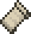
  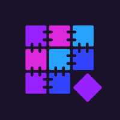
  
  

Сборка построена на базе Fabric 1.20.1 с Sodium, Iris и Quilt. Установленные здесь моды не добавляют никаких новых предметов, а только улучшают комфорт от игры, производительность и внешний вид, сохраняя максимально ванильную стилистику. 

Папка mods насчитывает более 80 модов, 30+ ресурспаков, а также несколько самых популярных наборов шейдеров. Всё это уже настроено для наиболее комфортной и ванильной игры.

Вот несколько самых значительных элементов:

  

    
    
<strong>Emotecraft</strong> - позволяет использовать различные анимации вашего персонажа и видеть анимации других игроков на серверах, где это поддерживается. В сборку уже включено множество эмоций из <a target="_blank" href="https://docs.google.com/document/d/1AK0w8M1_oZ3Z3VxoETT4QJ-OjVsP1AzqE0kHhSazymQ">SPEMOTES</a> и других открытых источников.

  

  

    
    
<strong>Replay Mod</strong> - мод, позволяющий записывать повторы геймплея с возможностью настройки камеры и рендеринга видео.

  

  

    
    
<strong>Plasmo Voice</strong> - мод на голосой чат на серверах, где это поддерживается.

  

  

    

      
      
      
    

    
<strong>Sodium</strong>, <strong>Quilt</strong>, <strong>Iris</strong> и множество других модов, вносящих оптимизации в код игры и реализующих все фишки из OptiFine, такие как зум, поддержка шейдеров, соединяющиеся текстуры и прочее.

  

### Главное меню

Сборка встречает игрока обновлённым главным меню.

Мы установили ресурспак с атмосферной ночной панорамой старого хаба OUTBREAK и ресурспак, переключающий элементы интерфейса в стильную тёмную тему.

??? note "Светлая тема тоже есть"

    

За панорамы отвечают ресурспаки `outbreak-panorama-night` и `outbreak-panorama-day`, а за тёмный интерфейс - `Default Dark Mode`. Вы всегда можете включить или отключить их по желанию.

### Как настраивать моды

Нажмите кнопку `Моды 💎`. В списке слева видны все установленные моды. Многие из них имеют свои настройки, попасть в которые можно, кликнув по картинке мода. 

### Как включать и отключать моды {:id="enabling-mods"}

Некоторые моды добавлены в сборку, но не включены по умолчанию. Некоторые из них нестабильны и могут вызывать ошибки, а некоторые просто имеют узкую направленность и не нужны большинству игроков.

Вы можете включать и выключать моды и другие элементы лаунчере. Для этого нажмите правой кнопкой мыши по сборке и выберите `Редактировать`. В открывшемся окне можно ставить и снимать галочки напротив модов, ресурспаков и шейдеров на соответствующих вкладках слева.

    <label class="zoomableimg">
        <input type="checkbox">
        

            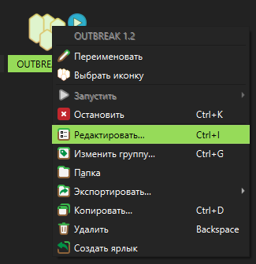
        

    </label>
    <label class="zoomableimg">
        <input type="checkbox">
        

            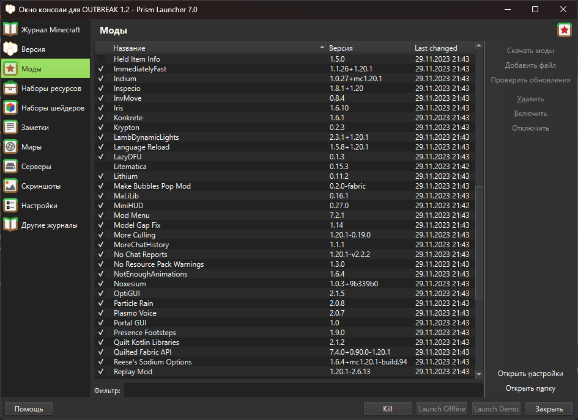
        

    </label>

---

## 🌸 Эстетические улучшения

### Ресурспаки

Одним из главных визуальных изменений сборки является глобальный ресурспак Stay True. Этот ресурспак ощущается максимально ванильно, но игра с ним начинает выглядеть гораздо более живой и веющей свежестью. Он делает немного ярче окраску биомов, добавляет вариации травы и соединения блоков.

??? info "Пышные листья"
    Помимо этого, Stay True имеет пышные листья (первая картинка). По умолчанию в сборке листья заглушены специальным дополнением, поскольку они оказывают влияние на производительность, да и не всем могут понравиться. Пышные листья можно включить обратно, убрав ресурспак No Bushy Leaves.

    <label class="zoomableimg">
        <input type="checkbox">
        

            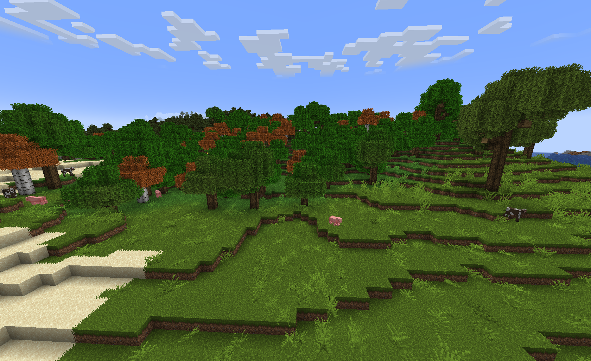
        

    </label>
    <label class="zoomableimg">
        <input type="checkbox">
        

            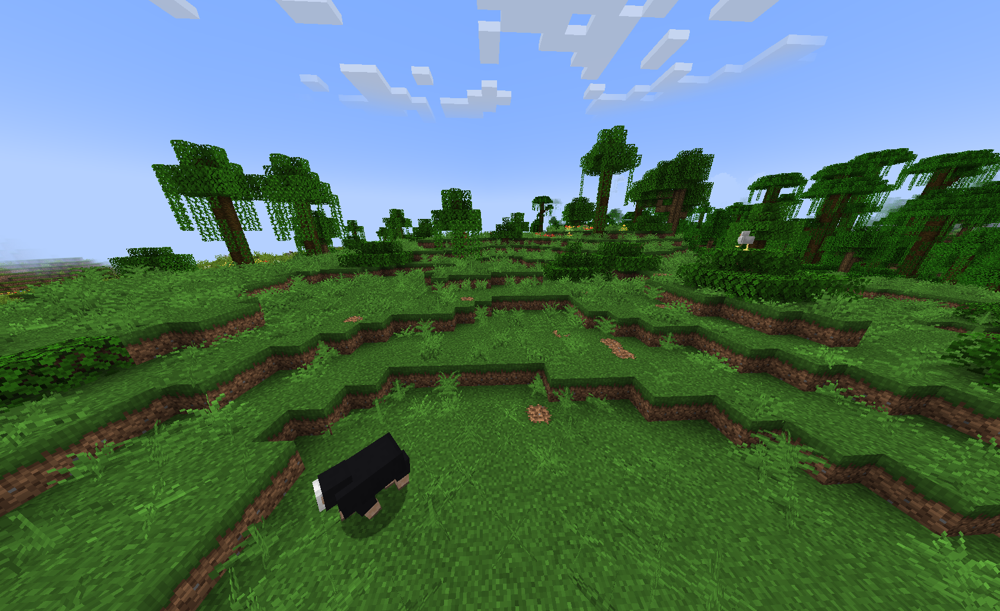
        

    </label>
    <label class="zoomableimg">
        <input type="checkbox">
        

            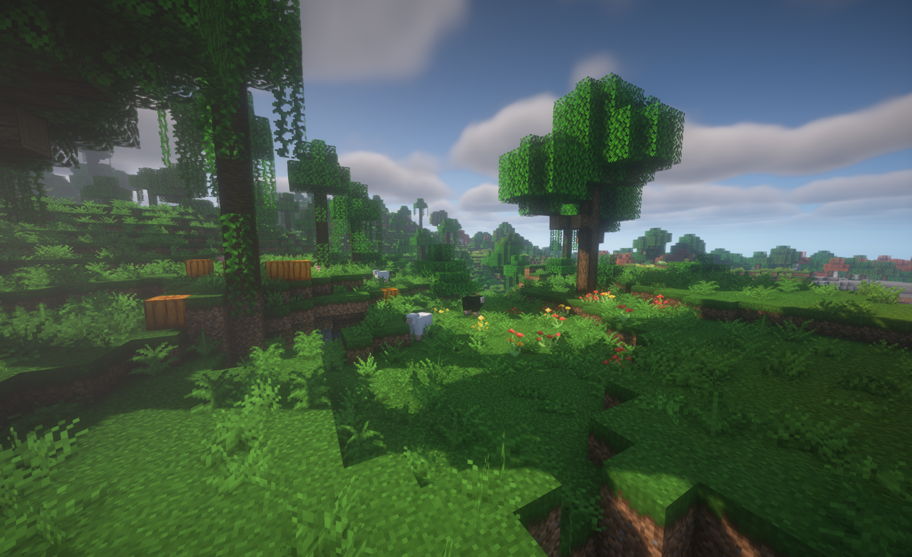
        

    </label>
    <label class="zoomableimg">
        <input type="checkbox">
        

            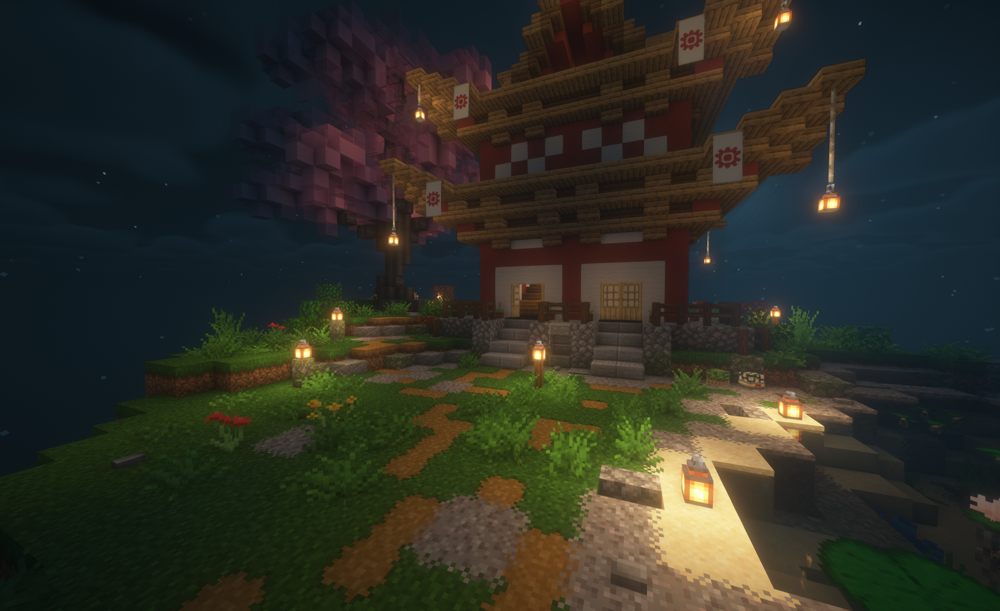
        

    </label>

Ресурспак Os' Shulkers добавляет красивые узоры на шалкеры.

    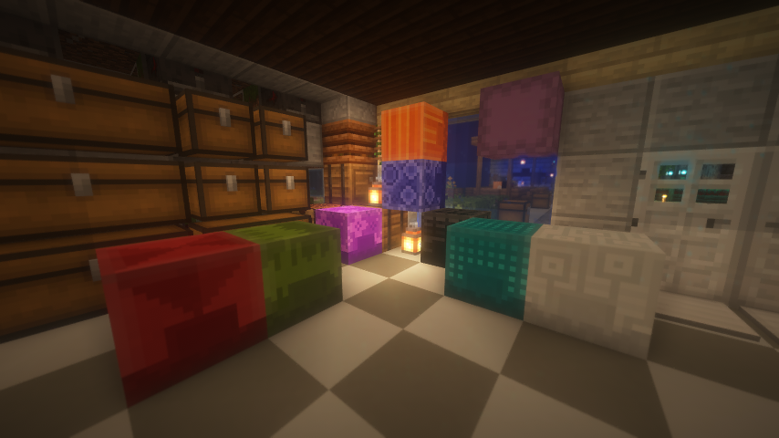
    
Циановый - мой абсолютный фаворит

Как ценители эстетики, мы конечно не могли не добавить [лучший ресурспак на гастов](https://www.planetminecraft.com/texture-pack/blushing-ghast/) и [лучший ресурспак на тыквы](https://www.planetminecraft.com/texture-pack/cute-pumpkins-1-16-4/)!

    <label class="zoomableimg">
        <input type="checkbox">
        

          

              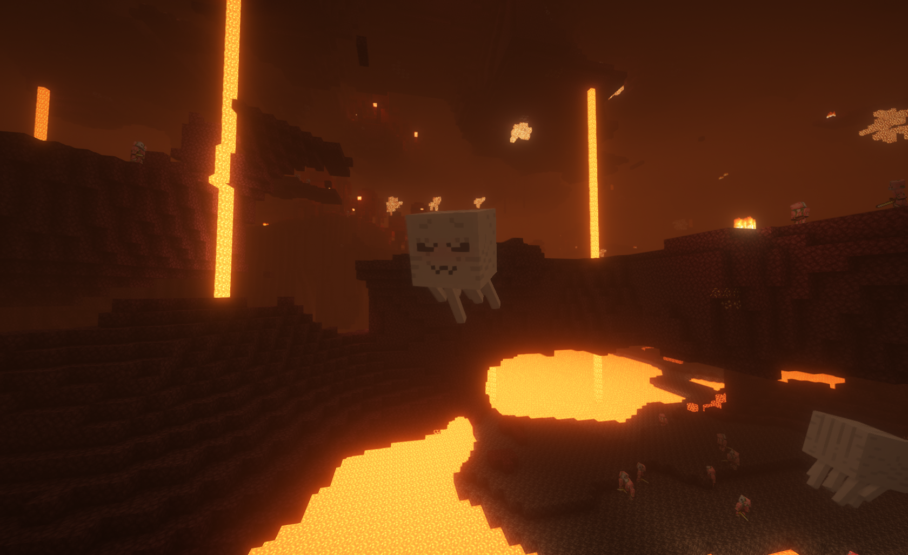
              
UwU

          

        

    </label>
    <label class="zoomableimg">
        <input type="checkbox">
        

          

              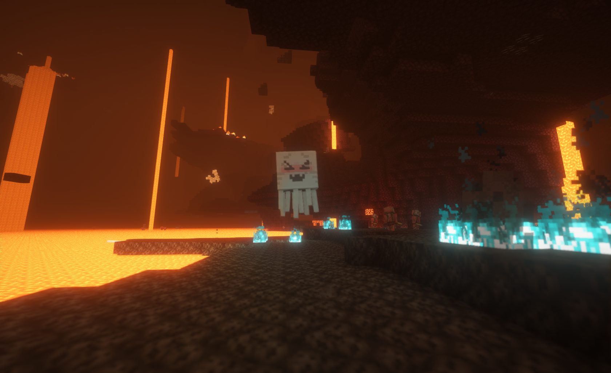
              
OwO

          

        

    </label>

  <label class="zoomableimg">
      <input type="checkbox">
      

        

            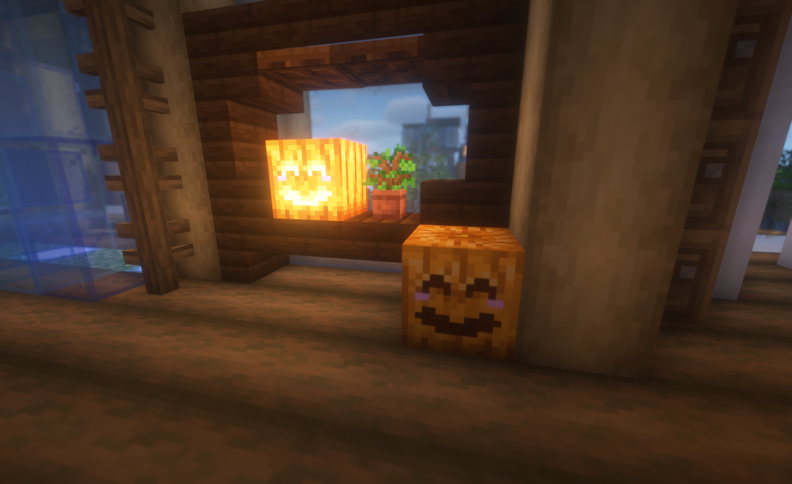
            
😍

        

      

  </label>

Ещё немного милых ресурспаков - лестницы, разнообразные кувшинки, объёмный тростник и другое.

    <label class="zoomableimg">
        <input type="checkbox">
        

            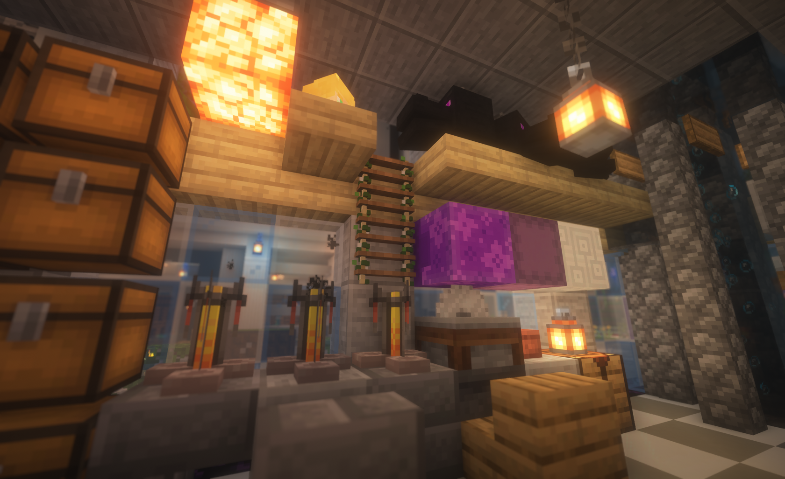
        

    </label>
    <label class="zoomableimg">
        <input type="checkbox">
        

            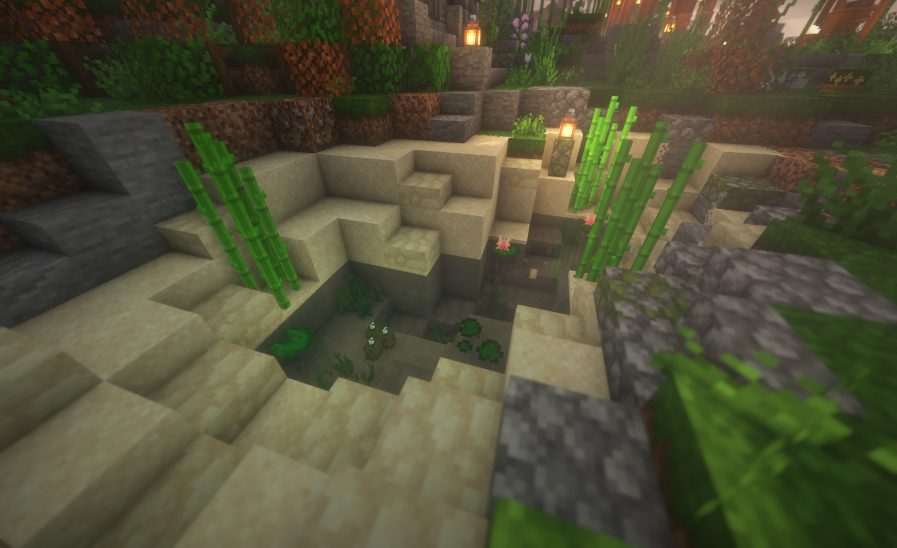
        

    </label>
    <label class="zoomableimg">
        <input type="checkbox">
        

            

                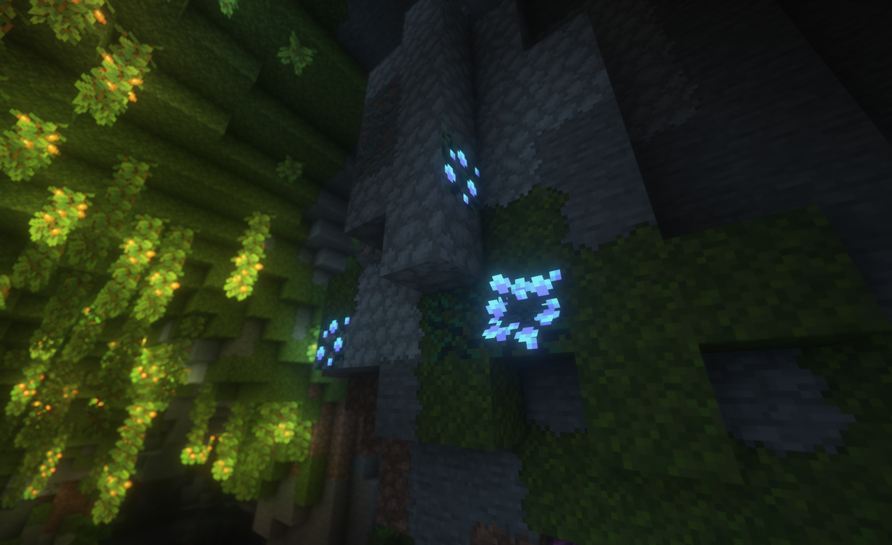
                
Лишайник, каким он должен быть

            

        

    </label>
    <label class="zoomableimg">
        <input type="checkbox">
        

            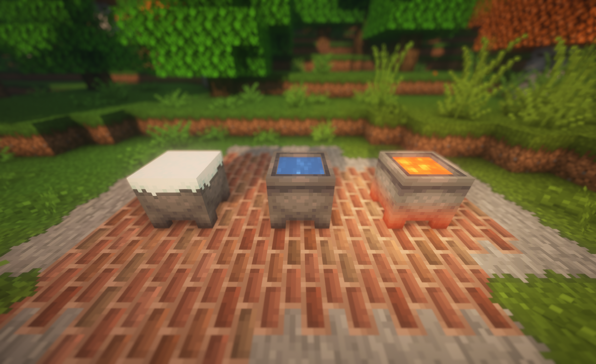
        

    </label>

### Взрывы

Мод [Explosive Enhancement](https://modrinth.com/mod/explosive-enhancement) изменяет визуальные эффекты взрывов на более эпичные и стилизованные

    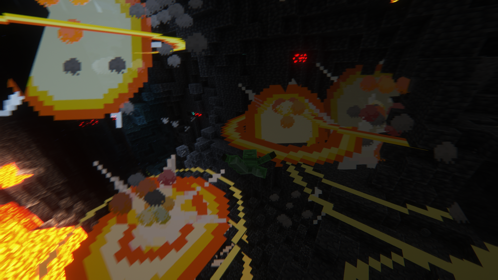
    
В последней версии взрывы светятся ✨

### Улучшенная погода

Мод [Particle Rain](https://www.curseforge.com/minecraft/mc-mods/particle-rain) улучшает погодные эффекты. Снег больше не является плоской текстурой, теперь он красиво и реалистично падает с неба, а в пустыне теперь можно увидеть пыльную бурю.

??? warning "Сделайте это, если не собираетесь использовать шейдеры"

    Вопреки названию, вид дождя в этом моде изменён незначительно, но при этом он никак не подхватывается шейдерами и выглядит с ними просто ужасно. Поэтому кастомный дождь отключен в настройках мода.

    Если вы не собираетесь использовать шейдеры, настоятельно рекомендуем зайти в `Моды -> Particle Rain (кнопка настроек на иконке мода)`, отключить `Render Vanilla Weather` и включить `Do Rain Particles`. Это сделает снег чище, отключив старый снег под новым, и включит улучшенный дождь.

    
    

### Анимация еды

Теперь еда анимирована, а также у игроков есть анимация руки, когда они едят еду.

    
    
До создания этой сборки я и не знал, что в майнкрафте всё настолько плохо, что другие игроки даже не видят анимацию руки.

### Blur

Мод размывает фон, когда вы заходите в какой-либо интерфейс. Размытие можно настраивать в меню модов -> Blur.

### Падающие листья

Мод [Falling Leaves](https://modrinth.com/mod/fallingleaves) делает леса более живыми, добавляя в них листья, падающие с деревьев.

### Звуки

Мод [ExtraSounds](https://modrinth.com/mod/extrasounds) добавляет приятные звуки для инвентаря, а [Presence Footsteps](https://modrinth.com/mod/presence-footsteps) - звуки шагов по различным поверхностям. Там даже есть шорох травы!

  <iframe width="560" height="315" src="https://www.youtube-nocookie.com/embed/PG3VZ_DmbRk?si=Ak1yXnkxmnvWGXju" title="YouTube video player" frameborder="0" allow="accelerometer; autoplay; clipboard-write; encrypted-media; gyroscope; picture-in-picture; web-share" allowfullscreen></iframe>

  <iframe width="560" height="315" src="https://www.youtube-nocookie.com/embed/uSZvsO3fyMg?si=jCPryoQ3aBBaC-MJ" title="YouTube video player" frameborder="0" allow="accelerometer; autoplay; clipboard-write; encrypted-media; gyroscope; picture-in-picture; web-share" allowfullscreen></iframe>

## 💬 Чат

### Анимации, скины, история

Чат стал лучше буквально во всём. Сообщения теперь отправляются с плавной анимацией и содержат лицо скина отправителя, длина прокрутки истории чата была расширена и сохраняется между перезаходами в миры, как и история отправки на ++arrow-up++, а ещё спам одинаковыми сообщениями теперь отображается как одно сообщение со счётчиком.

### Эмоджи

Теперь вы можете отправлять различные символы, прописывая их названия, заключённые в `:`, подобно тому как это работает с эмоджи в Discord.

### Японский шрифт

Также мы добавили ресурспак [MisakiGothic2​forMC](https://kabanfriends.github.io/minecraft/misaki2/) на японские символы в ванильном пиксельном стиле.

    <label class="zoomableimg">
        <input type="checkbox">
        

          

              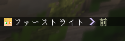
              
前 (до)

          

        

    </label>
    <label class="zoomableimg">
        <input type="checkbox">
        

          

              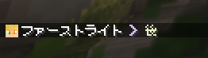
              
後 (после)

          

        

    </label>

---

## 🔥 Улучшения игрового опыта

### Просмотр шалкеров

Просматривать шалкеры теперь можно в инвентаре, не заходя в них, а интерфейс открытого шалкера зависит от его цвета!

  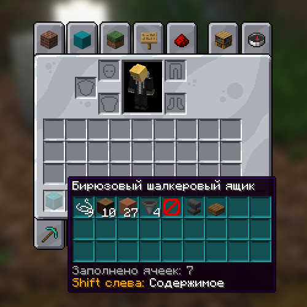
  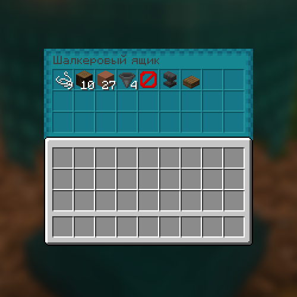

### F3+F4 и свет без /op

Раньше у вас могли быть права на смену режима игры на сервере, но клиент не давал использовать быстрое меню на ++f3+f4++ без прав оператора (`/op`). Также без прав оператора не работала вкладка со светом, командным блоком и палочкой отладки в креативе. Моды [Switcher](https://modrinth.com/mod/switcher) и [Show Operator Tab](https://modrinth.com/mod/show-operator-tab) решают эти недоразумения. 

  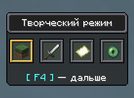
  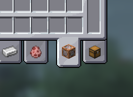

### Скриншоты в буфер обмена

Скриншоты теперь автоматически копируются в буфер обмена. Это значит, что вы можете просто нажать ++ctrl+v++ в поле ввода сообщения в Discord или VK, чтобы прикрепить только что сделанную картинку к сообщению.

### Перетаскивание элементов

Больше не нужно нажимать на неудобные стрелочки - ресурспаки и сервера теперь перетаскиваются!

### Книги и зелья

В зельеварку установлена схема от [THE_PINPAL](https://www.curseforge.com/minecraft/texture-packs/in-game-brewing-guide), а благодаря [xali's Potion](https://modrinth.com/resourcepack/xalis-potion) все зелья выглядят по-разному, а книги снабжены нашими собственными иконками!

    <label class="zoomableimg">
        <input type="checkbox">
        

            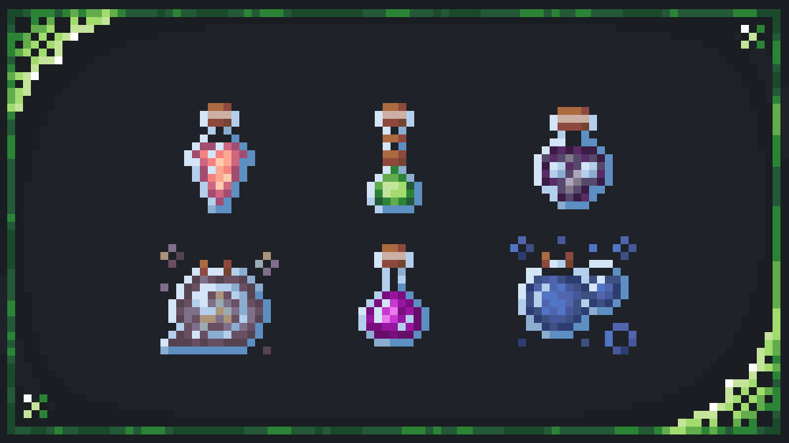
        

    </label>
    <label class="zoomableimg">
        <input type="checkbox">
        

            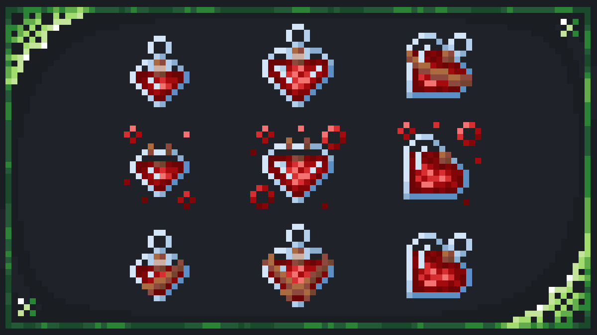
        

    </label>
    <label class="zoomableimg">
        <input type="checkbox">
        

          

              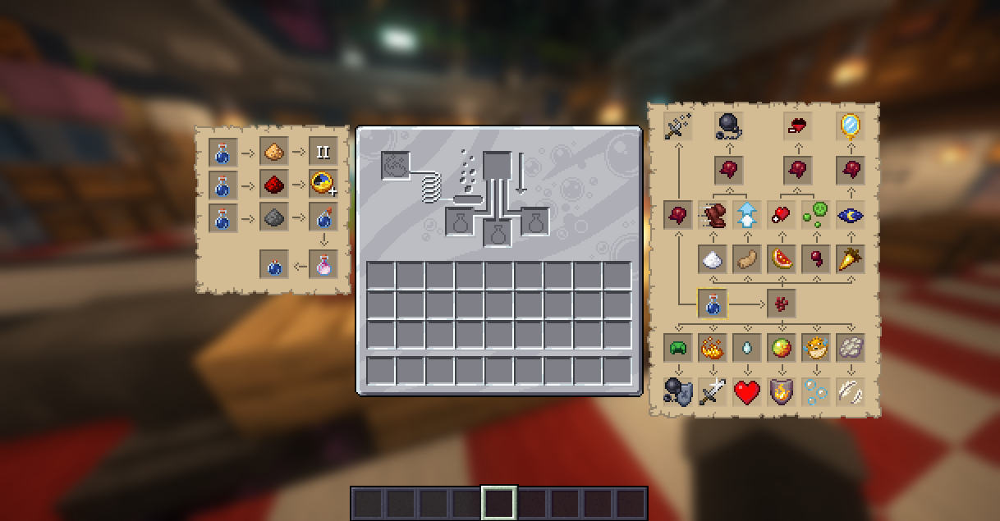
              
Признайся гуглил 🥺

          

        

    </label>
    <label class="zoomableimg">
        <input type="checkbox">
        

            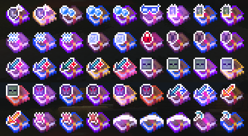
        

    </label>

### Индикатор брони

Иконки брони теперь зависят от того, что на вас надето.

  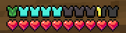

### Еда

Мод [AppleSkin](https://www.curseforge.com/minecraft/mc-mods/appleskin) добавляет удобную визуализацию голода и эффективности разной еды.

  

      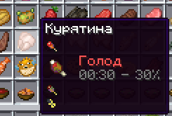
      
Эффекты и насыщение от еды в описаниях

  

  

      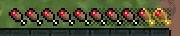
      
Текущее насыщение

  

  

      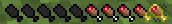
      
Сколько голода и насыщения может восполнить еда (при удерживании еды)

  

  

      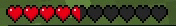
      
Потенциальное восстановление здоровья (при удерживании еды)

  

### MiniHUD

Мод MiniHUD добавляет маленькую панель в углу экрана, которая может отображать различные данные, такие как FPS, время и координаты. Это удобнее, чем каждый раз открывать громоздкий F3 чтобы посмотреть их.

Панель скрывается и показывается клавишей ++h++.

  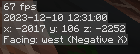

### Улучшенный F3

Мы установили мод [Better F3](https://modrinth.com/mod/betterf3) и настроили его, убрав из панелей F3 всё бесполезное. Теперь информация разделена на группы разного цвета, в которых легко найти то, что нужно.

### Чистые скорборды

Мод [Ugly Scoreboard Fix](https://modrinth.com/mod/ugly-scoreboard-fix) убирает из скорбордов красные цифры справа, являющиеся побочным эффектом, без которого нельзя создать скорборд.

  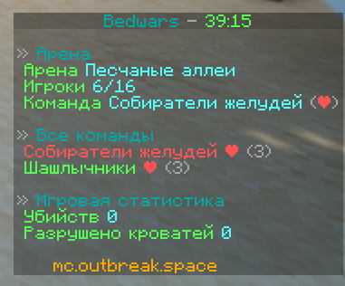

### Ходьба с открытым GUI

    
    
Некоторые считают это читом, но мы не против

---

## 🚀 Оптимизация

### Сравнение FPS и RAM

??? info "Локация 1"

    Ванилла:
    

    Сборка:
    

??? info "Локация 2"

    Ванилла:
    

    Сборка:
    

Тестирование проводилось с максимальными настройками ваниллы с прорисовкой 20 чанков и аналогичными настройками на сборке. Как видно на скриншотах выше, благодаря всем модам на оптимизацию, в сборке достигается до двух раз больше FPS, чем в ванилле.

FPS в ванилле держится около 120-160, тогда как в сборке он достигает 260-360 в зависимости от места.

Тем не менее сборка потребляет в среднем на 300 мб оперативной памяти больше, чем ванилла. При измерениях показатель потребления ОЗУ в ванилле держался около 850 мб, ни разу не превысив 1000, тогда как в сборке он варьировался от 850 до 1300.

### Быстрое применение языков

Меню языков изменено, а сами языки теперь применяются мгновенно, без загрузки.

---

## 🪽 Прочее

### Command Macros

Мод Command Macros незаменим, если вы часто работаете над постройками с WorldEdit или модерируете сервер с CoreProtect. Этот мод позволяет назначить команды на клавиши или их сочетания. Строительство ощущается совсем иначе с Ctrl + Z, Ctrl + C и Ctrl + V!

!!! info
    Конфигурация со скриншота не идёт со сборкой. Настройте свои клавиши так, как хотите сами.

### Auth Me

Этот мод позволяет менять аккаунт, не перезаходя в игру. В правом верхнем углу в меню серверов можно найти кнопку логина, нажав на которую, вы можете войти как в аккаунт Mojang или Microsoft, так и в автономном режиме (как пират).

  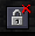
  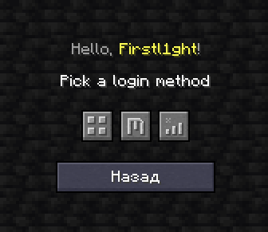

---

## ⚙️ Отключённые моды

!!! warning "Внимание!"
    Ниже описанные моды находятся в архиве, но не включены. Чтобы пользоваться ими, [включите их в лаунчере](#enabling-mods).

### Slot Cycler

Мод [Slot Cycler](https://modrinth.com/mod/slot-cycler) позволяет видеть рядом с хотбаром колонки инвентаря и прокручивать их, удерживая ++alt++ или нажимая на кнопку номера слота несколько раз. 

Довольно полезный мод, но некоторым может показаться сложной и неванильная механикой, так что включайте по своему желанию.

### IBE Editor

Редактор NBT на клавишу ++i++. Удобно для разработчиков модов и плагинов или для авторов ресурспаков с поддержкой CustomModelData.

### Litematica

Продвинутый мод для создания схем для копирования построек. Позволяет создать схему, узнать, сколько и каких блоков понадобится и разместить полупрозрачную схему в мире для дальнейшей постройки. Также может напрямую вставлять постройки при наличии нужных прав.

### WorldEdit CUI

Маст-хэв мод для тех, кто работает с WorldEdit. Показывает текущее выделение, работает на серверах.

### Physics Mod Pro

Мод, добавляющий реалистичную физику воды, качающиеся на ветру лианы, анимрованные двери, реалистичный снег и другие физические явления. Ванильным его точно назвать нельзя, да и на производительность он влияет очень сильно, но если у вас мощный компьютер и вы хотите _открыть майнкрафт по-новому_ - этот мод стоит попробовать.

??? note "Встроенная конфигурация"
    В сборке уже есть конфиг для этого мода. В нём большинство эффектов сведены к максимально ванильным, так как некоторые из них были довольно раздражающими. Вы можете включить их обратно или удалить конфиг из папки `config` и настроить мод по-своему.

<iframe width="560" height="315" src="https://www.youtube-nocookie.com/embed/uaTOxH6NbI4?si=-FDH6_u3FDNSnWeZ" title="YouTube video player" frameborder="0" allow="accelerometer; autoplay; clipboard-write; encrypted-media; gyroscope; picture-in-picture; web-share" allowfullscreen></iframe>

### Vectorientation

[Vectorientation](https://modrinth.com/mod/vectorientation) добавляет стильные мультяшные деформации падающих блоков. Довольно неванильно и неизвестно как действует на производительность, поэтому по умолчанию решено было отключить.

### Wakes

Мод [Wakes](https://modrinth.com/mod/wakes) добавляет след от лодки на воде. Несовместим с большинством шейдеров.

### Tweakeroo

Мод [Tweakeroo](https://www.curseforge.com/minecraft/mc-mods/tweakeroo) приносит большое количество различных возможностей и настроек в игру. Некоторые из них сложны, неванильны и узкоспециализированы, а некоторые вовсе могут считаться читами. Разбирайтесь в этом на свой страх и риск.

<iframe width="560" height="315" src="https://www.youtube-nocookie.com/embed/ZCdU_b66cQg?si=xjyFPwrChWiaz_w5" title="YouTube video player" frameborder="0" allow="accelerometer; autoplay; clipboard-write; encrypted-media; gyroscope; picture-in-picture; web-share" allowfullscreen></iframe>

### Held Item Info

Мод [Held Item Info](https://www.curseforge.com/minecraft/mc-mods/held-item-info) показывает список зачарований над хотбаром, когда вы берёте в руку предмет. Включайте по желанию.

---

На этом обзор подходит к концу. На самом деле здесь были перечислены не все моды и ресурспаки, а только наиболее значительные. Вы можете [скачать](index.md#latest) нашу сборку и сами увидеть всё, что в ней есть. Приятной игры!